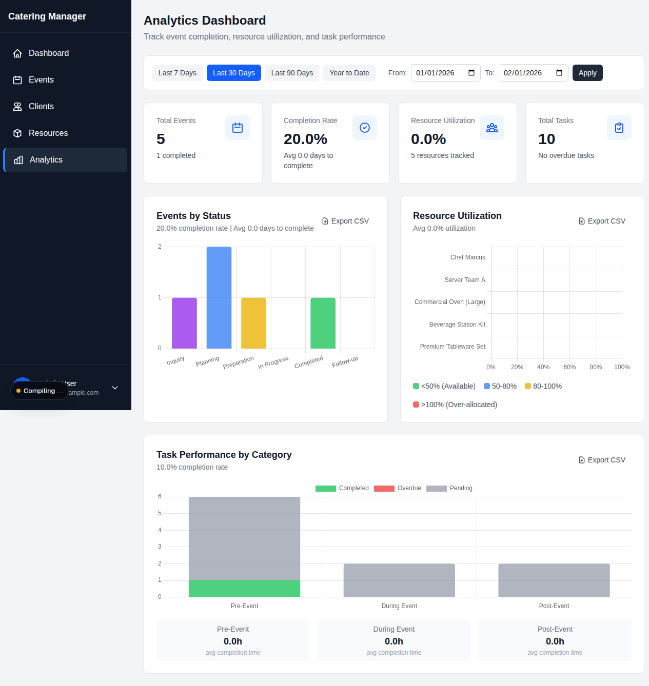

# Catering Event Manager

[](https://github.com/rodartecode/catering-event-manager/actions/workflows/ci.yml)
[](LICENSE)
[](https://nextjs.org/)
[](https://go.dev/)
[](https://www.typescriptlang.org/)

End-to-end event lifecycle management for catering companies — from initial inquiry through post-event follow-up. Hybrid Next.js 16 + Go Fiber v3 monorepo with PostgreSQL 17, tRPC v11, and Drizzle ORM.

**[→ Live demo](https://catering-event-manager.vercel.app)** · sign in as `admin@demo.catering` / `demo123!` (demo DB reseeded weekly)



## Features

- **Event lifecycle** — inquiry → planning → preparation → in-progress → completed → follow-up, with status history and archiving
- **Task management** — assignment, dependencies, overdue detection, auto-generation from menu items
- **Resource scheduling** — staff/equipment with sub-100ms conflict detection (Go service backed by PostgreSQL GiST indexes)
- **Kitchen production** — stations with capacity-aware scheduling, production tasks auto-generated from menus
- **Menu planning** — global catalog, per-event menus, dietary tracking, cost estimation, cross-event shopping lists
- **Financial layer** — expenses, invoicing with PDF export, payments with auto-status transitions, profitability analytics
- **Document management** — Supabase Storage uploads, presigned URLs, client portal sharing
- **Vendor directory** — 8 service types, per-event assignments, vendor-linked expenses
- **Analytics** — event completion rates, resource utilization, task performance, CSV export
- **Notifications** — in-app bell, per-type preferences, email digests via Resend
- **Client portal** — magic-link authentication, read-only event/document access
- **Role-based auth** — Administrator / Manager / Client with Next-Auth v5

See [API.md](API.md) for the full tRPC surface — 19 routers, 150 procedures.

## Architecture

**Hybrid microservices monorepo**:

- **`apps/web/`** — Next.js 16 app: UI, tRPC v11 API, authentication, CRUD
- **`apps/scheduling-service/`** — Go Fiber v3 service: resource conflict detection (target <100ms)
- **`packages/database/`** — Drizzle ORM schemas shared across both services (TS + SQLC for Go)

| Layer | Tech |
|-------|------|
| Frontend | Next.js 16, React 19, Tailwind CSS 4, Biome |
| API | tRPC v11, Zod 4, Next-Auth v5 |
| Database | PostgreSQL 17, Drizzle ORM, Row Level Security on all 30 tables |
| Scheduling | Go 1.26, Fiber v3, SQLC, GiST indexes for O(log n) range queries |
| Tooling | pnpm workspaces, Turborepo, Vitest, Playwright, TestContainers |
| Hosting | Vercel (web), Fly.io (scheduler), Supabase (Postgres) |

→ [ARCHITECTURE.md](ARCHITECTURE.md) for design decisions and patterns.

## Quick Start

**Prerequisites**: Node.js 22 LTS · pnpm 10+ · Go 1.26+ · Docker · PostgreSQL 17 (or Docker)

```bash
# 1. Install
pnpm install

# 2. Environment
cp .env.example .env
cp apps/web/.env.example apps/web/.env.local
cp apps/scheduling-service/.env.example apps/scheduling-service/.env
# Generate auth secret: openssl rand -base64 32
# Edit each .env and set NEXTAUTH_SECRET, DATABASE_URL, RESEND_API_KEY

# 3. Database
docker-compose up -d postgres
cd packages/database && pnpm db:push && pnpm db:seed && cd ../..

# 4. Run
pnpm dev                                     # Next.js on :3000
cd apps/scheduling-service && go run cmd/scheduler/main.go   # Go on :8080
# (or `docker-compose up` for everything)
```

**Health checks**: `http://localhost:3000/api/health` · `http://localhost:8080/api/v1/health`

→ Detailed commands: [COMMANDS.md](COMMANDS.md) · environment variables: [ENV.md](ENV.md) · troubleshooting: [TROUBLESHOOTING.md](TROUBLESHOOTING.md)

## Project Structure

```
catering-event-manager/
├── apps/
│   ├── web/                    # Next.js 16 application
│   │   ├── src/app/            # App Router routes
│   │   ├── src/server/         # tRPC routers (19 domains)
│   │   └── src/components/     # React components (22 domains)
│   └── scheduling-service/     # Go Fiber v3 service
│       ├── internal/domain/    # Core entities (no deps)
│       ├── internal/scheduler/ # Conflict + availability algorithms
│       ├── internal/api/       # HTTP handlers
│       └── internal/repository/  # SQLC-generated data access
├── packages/
│   ├── database/               # Drizzle schemas + migrations (shared)
│   ├── types/                  # Shared TypeScript types
│   └── config/                 # Shared TS / Tailwind configs
├── docs/                       # ADRs, deployment, learnings, screenshots
└── docker-compose.yml          # Local dev stack
```

## Development

```bash
pnpm dev                  # All dev servers (Next.js; start Go separately)
pnpm build                # Build all
pnpm test                 # Run all tests (Vitest + Go)
pnpm type-check           # TypeScript across the monorepo
pnpm lint && pnpm format  # Biome
pnpm db:generate          # Drizzle migrations
pnpm db:migrate           # Apply migrations
pnpm db:seed              # Local sample data
pnpm db:seed:demo         # Wipe + reseed demo dataset (demo env only — destructive)
```

## Testing

PostgreSQL TestContainers for isolated DB tests. Real database, not mocks — keeps integration drift out of CI.

- **TypeScript**: 1700+ tests across 100+ files (Vitest 4) — every tRPC router covered, plus React component tests with mocked tRPC hooks
- **Go**: 40+ tests with 91.7% scheduler coverage, 100% on conflict-detection algorithms
- **E2E**: Playwright with quality gates for visual regression (<1% pixel diff), accessibility (WCAG 2.1 AA via axe-core), and Core Web Vitals

```bash
pnpm test                                          # All TS tests
go test ./...                                      # In apps/scheduling-service
pnpm --filter @catering-event-manager/web test:e2e # Playwright
pnpm test:quality                                  # Visual / a11y / perf gates
```

→ Test infrastructure details in `apps/web/test/` and `apps/scheduling-service/internal/testutil/`.

## Demo data

The public demo at [catering-event-manager.vercel.app](https://catering-event-manager.vercel.app) is migrated and reseeded every Sunday at 02:00 UTC by a Vercel cron route (`/api/cron/reset-demo`, dual-flag guarded with `NEXT_PUBLIC_IS_DEMO` + `DEMO_RESET_ALLOWED`). The cron runs journal-tracked Drizzle migrations before TRUNCATE+seed, so schema changes shipped between firings don't leave the demo stuck on an old shape.

Logins after a fresh seed:

| Role | Email | Password |
|------|-------|----------|
| Owner | `admin@demo.catering` | `demo123!` |
| Ops Manager | `manager@demo.catering` | `demo123!` |
| Lead Chef | `chef.marin@demo.catering` | `demo123!` |
| Client portal | `priya@lumen-robotics.demo` | (magic link) |

Showcase dataset: 5 clients · 10 events spanning past/present/future · 4 venues · 10 vendors (all 8 service types) · kitchen stations with auto-scheduled production tasks · vendor-linked expenses · paid + sent invoices.

For lighter local seed data, use `pnpm db:seed`.

## Deployment

| Service | Platform | Notes |
|---------|----------|-------|
| Web | Vercel | Auto-deploys on push to `main` |
| Scheduler | Fly.io | Internal — fronted by the web app |
| Database | Supabase | PostgreSQL 17 with RLS |

→ Full deployment guide: [docs/DEPLOYMENT.md](docs/DEPLOYMENT.md). Production hardening (rate limiting, CSRF, CSP, headers, RLS) is documented in [SECURITY.md](SECURITY.md) and [docs/DEPLOYMENT.md](docs/DEPLOYMENT.md).

## License

[MIT](LICENSE) © Jesse Rodarte

---

**API reference** — [API.md](API.md) · **Contributing** — [CONTRIBUTING.md](CONTRIBUTING.md) · **Architecture** — [ARCHITECTURE.md](ARCHITECTURE.md)
